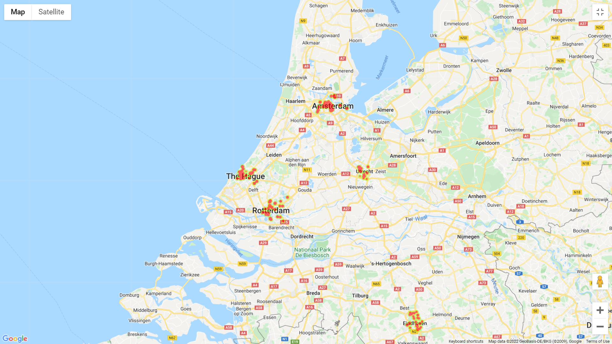

# nl-house-price
Predict house price in 5 biggest cities in the Netherlands (Amsterdam, Den Haag, Eindhoven, Rotterdam, and Utrecht) based on data scraped from [Pararius](https://www.pararius.nl/koopwoningen) (compliant to ToS) and Google Places.

# Data 

pararius-requests.py: Scrape each city's house listings from Pararius

clean.py: Clean data to get price, postcode, size, number of bedrooms, and year constructed/last renovated

distance.py: Convert postcode into coordinates, then calculate the distance from each house to the city's Centraal Station (distance1)

google-maps-rating.py: For each house, get 20 nearest restaurants/bars within 1km radius, and 5 most recent ratings of each, then calculate the average rating (nearby rating)

merge.py: Merge data from 5 cities into one file, added column for city name

standardize.py: For each city, divide price and distance1 by their average (std price and std distance1)

# EDA

gmaps.py: Draw heatmap based on price

plots.py: Draw price histograms

# Random forest

model.py: Initial model

tuning.py: Find the best parameters

model-tuned.py: Model with the best parameters

prediction.py: Take in postcode, size, number of bedrooms, year constructed, and city, then return the predicted price

# Remarks

- Size seems to be the biggest influence on price
- Higher population, higher price

# References

[gmaps](https://github.com/pbugnion/gmaps)

[python-google-places](https://github.com/slimkrazy/python-google-places)

[ams-house-price](https://github.com/doanthevu1910/ams-house-price)